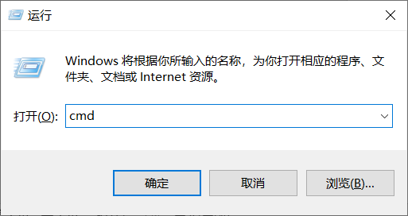
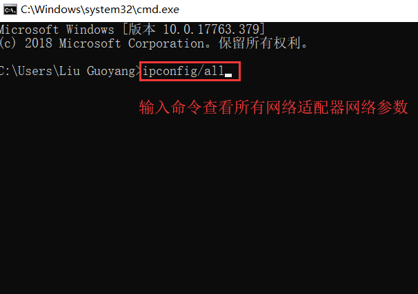
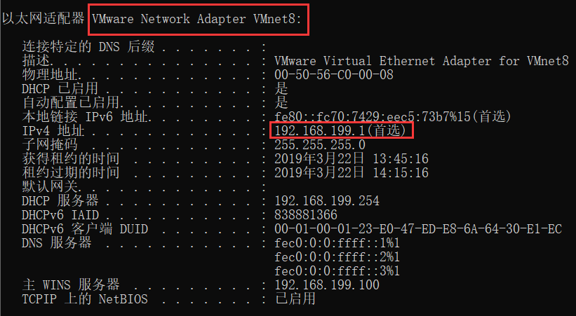
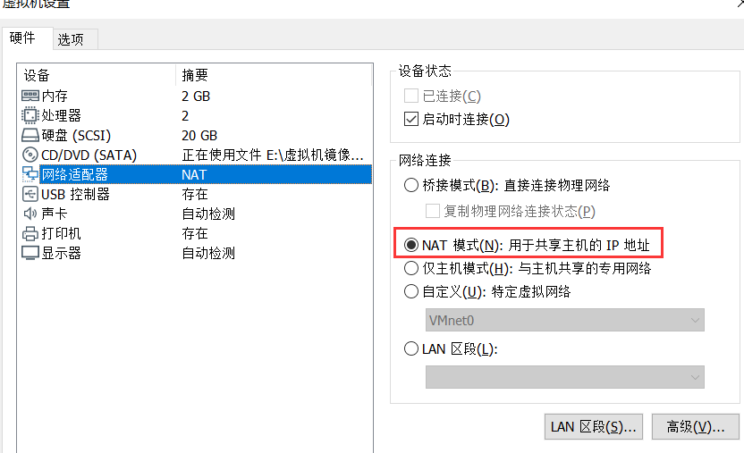
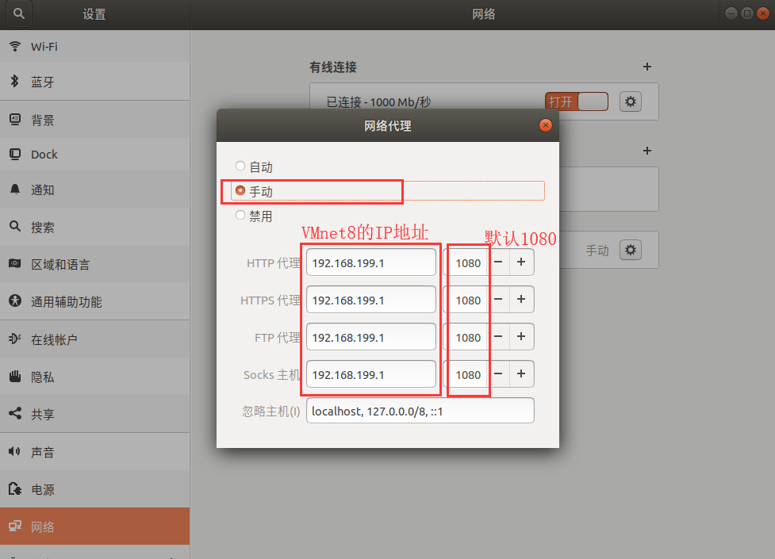
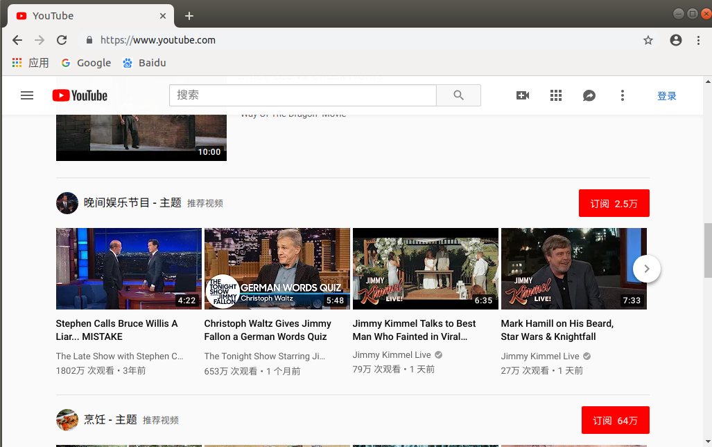

1、 查看VMnet8的IP地址

Win+R打开运行窗口，输入cmd进入DOS界面

输入ifconfig/all查看网络参数信息

查看VMnet8

2、配置VMware网络配置，选择“NAT模式”

3、打开VMware中的Ubuntu系统，“设置”—“网络”—“网络代理”

 

4、打开windows系统（安装VMware的本机系统）上的shadowsocks，勾选“允许其他设备连入”。

 

 

5、测试一下，可以访问国外网站了

